# Control Tower Atlas

Seventeen diagrams of the pipeline, each with the one thing worth looking at. The Mermaid source is read out of `docs/data_model.md` and `docs/ingestion.md`, so this page cannot drift from the repository.

**5** source systems | **233,150** rows ingested | **46** extraction resources | **80** dbt models | **207** tests, 4 warnings | **7** metrics live, 3 blocked

## Contents

- [§1 Getting the data out](#s1)
- [§2 The five source systems](#s2)
- [§3 Where the systems meet](#s3)
- [§4 The model the dashboards read](#s4)
- [§5 How one becomes the other](#s5)

## §1 Getting the data out

Five systems, five different problems. The extraction layer is real code; only the five clients that talk to the source systems are stood in for. Everything here was measured by building it, not by reasoning about it.

### Fig 1.1 — The seam

*Five files stand between the pipeline and five real source systems. They are the only files that change to go live.*

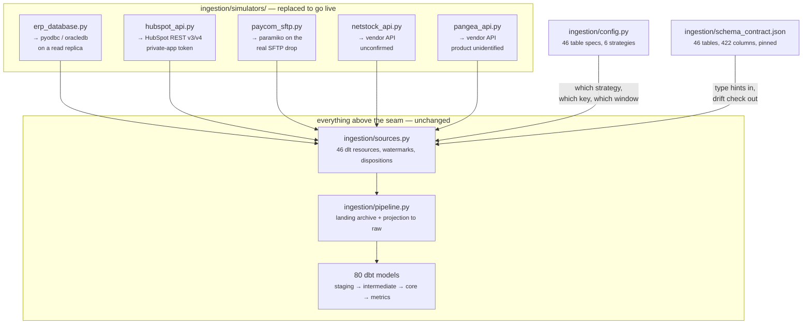

**What to look at.** Everything below the seam is written against rows. A row from a real ERP looks exactly like a row from this one, which is why the 46 extraction specs, the watermark logic and all 80 dbt models are already production code.

### Fig 1.2 — Two stages, not one

*Extraction lands an append-only Parquet archive; a pure-SQL projection builds the raw schemas from it.*

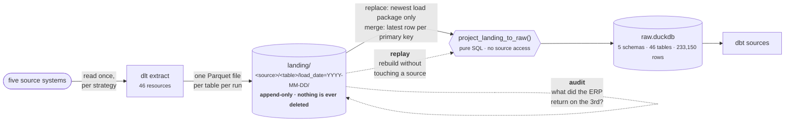

**What to look at.** Loading straight into the warehouse would have been half the code. The second stage buys replay — rebuild without touching a source, which matters most for Paycom, where an export is gone once the next one overwrites it.

### Fig 1.3 — How the ERP gets read, and what it loses

*19 of 22 Sage X3 tables carry no modification date, so line tables are windowed through their parent's business date.*

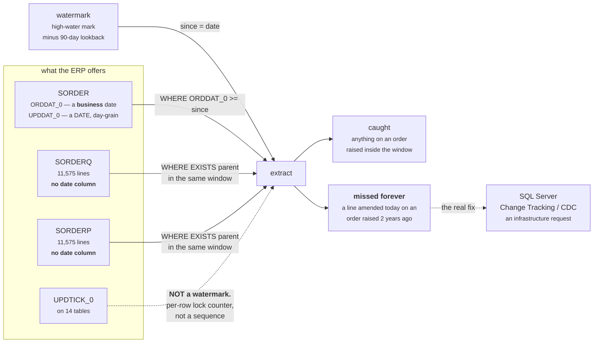

**What to look at.** UPDTICK_0 looks like a change signal and is not: it is a per-row lock counter, not a sequence. The trap is on the right — a line amended today on an order raised two years ago falls outside any window keyed on the order date.

### Fig 1.4 — What can be read incrementally

*A second run reads 46% of the rows. Two of the five sources read everything, every time.*

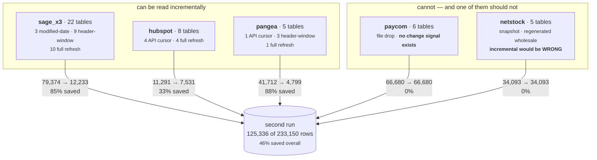

**What to look at.** Paycom has no change signal of any kind and never will. Netstock is different: it regenerates wholesale, so an incremental read would be actively wrong — a row that drops out of the recomputed set would persist in the warehouse forever.

### Fig 1.5 — How 26 rows disappeared

*Offset pagination over a non-unique sort key lost 26 rows and duplicated 26 others — and the row count never changed.*

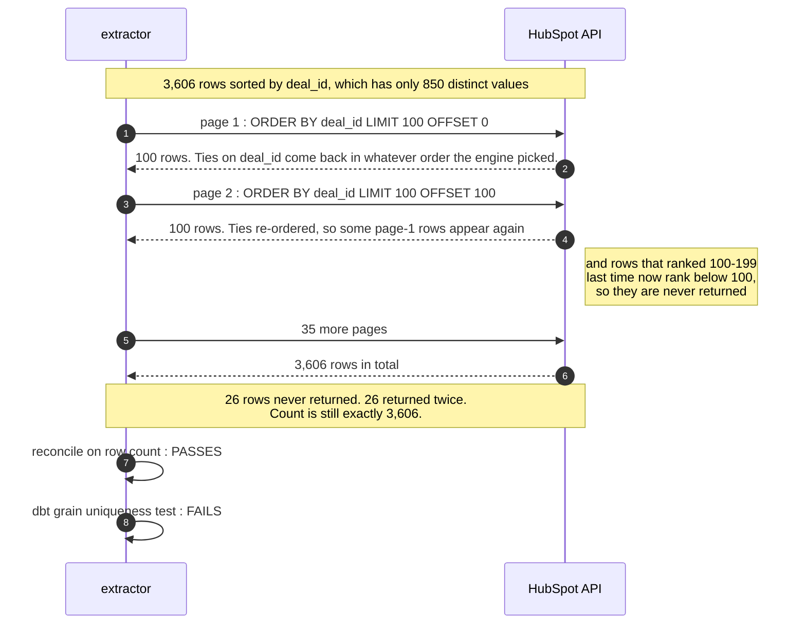

**What to look at.** This one actually happened during the build. A count-based reconciliation passed. The only thing that caught it was a grain uniqueness test in dbt, which is the argument for keeping those tests on every staging model.

## §2 The five source systems

Cardinalities and row counts are measured, not read off the schema. The annotations on the columns are the landmines: what is CHAR-padded, which dates are sentinels, which enums need a lookup, which key is not a key.

### Fig 2.1 — Sage X3 — ERP

*Every relationship resolves 100% after trimming. The risk in this estate is entirely at the system boundaries.*

```mermaid
erDiagram
    COMPANY ||--o{ FACILITY : "LEGCPY_0"
    FACILITY ||--o{ ITMFACILIT : "STOFCY_0"
    FACILITY ||--o{ SORDER : "SALFCY_0"
    FACILITY ||--o{ PORDER : "POHFCY_0"
    FACILITY ||--o{ GACCENTRY : "FCY_0"
    FACILITY ||--o{ STOCK : "STOFCY_0"
    FACILITY ||--o{ STOJOU : "STOFCY_0"
    FACILITY ||--o{ REPRESENT : "FCY_0"

    BPARTNER ||--o| BPCUSTOMER : "220 of 265"
    BPARTNER ||--o| BPSUPPLIER : "45 of 265"
    BPARTNER ||--o{ BPADDRESS : "BPANUM_0"
    BPARTNER ||--o{ GACCENTRYD : "BPR_0"

    REPRESENT ||--o{ BPCUSTOMER : "REP_0 and REP_1"
    REPRESENT ||--o{ SORDER : "REP_0 and REP_1"

    ITMMASTER ||--o{ ITMFACILIT : "ITMREF_0"
    ITMMASTER ||--o{ SORDERQ : "trim needed"
    ITMMASTER ||--o{ SORDERP : "trim needed"
    ITMMASTER ||--o{ SINVOICED : "ITMREF_0"
    ITMMASTER ||--o{ PORDERQ : "ITMREF_0"
    ITMMASTER ||--o{ STOCK : "ITMREF_0"
    ITMMASTER ||--o{ STOJOU : "trim needed"
    ITMMASTER ||--o{ ATEXTRA : "IDENT1_0"

    BPCUSTOMER ||--o{ SORDER : "BPCORD_0 trim needed"
    BPCUSTOMER ||--o{ SINVOICEV : "BPR_0"
    BPSUPPLIER ||--o{ PORDER : "BPSNUM_0"

    SORDER ||--o{ SORDERQ : "quantity side"
    SORDER ||--o{ SORDERP : "price side"
    SORDER ||--o{ STOJOU : "VCRNUM_0 where SDH"
    SORDERQ ||--o| SINVOICED : "SOHNUM_0 and SOPLIN_0"

    SINVOICEV ||--o{ SINVOICED : "NUM_0"
    SINVOICEV ||--o| GACCENTRY : "VCRNUM_0"

    PORDER ||--o{ PORDERQ : "POHNUM_0"
    GACCENTRY ||--o{ GACCENTRYD : "NUM_0"

    APLSTD ||--o{ ITMMASTER : "chapter 20 ITMSTA_0"
    APLSTD ||--o{ SORDER : "chapter 415 ORDSTA_0"
    APLSTD ||--o{ PORDER : "chapter 415 ORDSTA_0"
    APLSTD ||--o{ STOJOU : "chapter 700 TRSTYP_0"
    APLSTD ||--o{ ITMFACILIT : "chapter 861 REOMODE_0"

    COMPANY {
        varchar CPY_0 PK "2 rows: GLBUS, GLBCA"
        varchar CPYNAM_0
        varchar CRY_0
    }
    FACILITY {
        varchar FCY_0 PK "3 rows: US001 US002 CA001"
        varchar LEGCPY_0 FK
        varchar FCYNAM_0
        varchar CTY_0
    }
    BPARTNER {
        varchar BPRNUM_0 PK "265 rows"
        varchar BPRNAM_0
        bigint BPCFLG_0 "2 means customer"
        bigint BPSFLG_0 "2 means supplier"
        varchar CUR_0 "USD 229, CAD 36"
        bigint UPDTICK_0 "CDC hook"
    }
    BPCUSTOMER {
        varchar BPCNUM_0 PK "220 rows"
        varchar BPCNAM_0 "only link to HubSpot"
        varchar CUR_0
        varchar PTE_0 "payment terms"
        numeric BPCSNC_0 "credit limit"
        varchar REP_0 FK "array position 0"
        varchar REP_1 FK "array position 1, 41 rows"
    }
    BPSUPPLIER {
        varchar BPSNUM_0 PK "45 rows"
        varchar BPSNAM_0
        bigint LTI_0 "lead time days"
    }
    BPADDRESS {
        varchar BPANUM_0 PK "321 rows"
        varchar BPAADD_0 PK "multiple ship-tos"
        varchar CTY_0
    }
    REPRESENT {
        varchar REPNUM_0 PK "28 rows"
        varchar REPNAM_0 "LASTNAME FIRSTNAME"
        varchar FCY_0 FK
    }
    ITMMASTER {
        varchar ITMREF_0 PK "420 rows, NOT padded"
        varchar ITMDES1_0
        varchar TCLCOD_0 "category"
        bigint ITMSTA_0 "local menu ch 20"
        numeric BASPRI_0
        bigint UPDTICK_0 "CDC hook"
    }
    ITMFACILIT {
        varchar ITMREF_0 PK "886 rows"
        varchar STOFCY_0 PK
        bigint REOMODE_0 "local menu ch 861"
        numeric SAFSTO_0
    }
    SORDER {
        varchar SOHNUM_0 PK "4200 rows"
        varchar BPCORD_0 FK "CHAR-padded, all rows"
        varchar SALFCY_0 FK
        date ORDDAT_0
        date SHIDAT_0 "402 rows carry 1753-01-01"
        bigint ORDSTA_0 "local menu ch 415"
        varchar CUR_0 "USD 3512, CAD 688"
        varchar REP_0 FK
    }
    SORDERQ {
        varchar SOHNUM_0 PK "11575 rows"
        bigint SOPLIN_0 PK
        varchar ITMREF_0 FK "CHAR-padded, all rows"
        numeric QTY_0
        date DEMDLVDAT_0 "customer request date"
        numeric SHTQTY_0
    }
    SORDERP {
        varchar SOHNUM_0 PK "11575 rows"
        bigint SOPLIN_0 PK
        varchar ITMREF_0 FK "CHAR-padded, agrees with SORDERQ"
        varchar ITMDES1_0 "denormalised at order time"
        numeric NETPRI_0
        numeric AMTNOTLIN_0
    }
    SINVOICEV {
        varchar NUM_0 PK "3564 rows"
        varchar BPR_0 FK
        date INVDAT_0
        date PAYDAT_0 "492 rows carry 1753-01-01"
        varchar SIVTYP_0 "only value is SIN"
        numeric AMTNOTLIN_0
    }
    SINVOICED {
        varchar NUM_0 PK "9767 rows"
        bigint SIDLIN_0 PK
        varchar SOHNUM_0 FK "back-reference, 100 percent clean"
        bigint SOPLIN_0 FK
        numeric AMTNOTLIN_0 "sums to GL 41000 exactly"
    }
    PORDER {
        varchar POHNUM_0 PK "1400 rows"
        varchar BPSNUM_0 FK
        bigint ORDSTA_0 "local menu ch 415"
    }
    PORDERQ {
        varchar POHNUM_0 PK "2959 rows"
        bigint POPLIN_0 PK
        numeric RCPQTY_0 "receipt is a column, not a table"
        date RCPDAT_0 "576 rows carry 1753-01-01"
    }
    STOCK {
        varchar STOFCY_0 PK "1315 rows, current only"
        varchar ITMREF_0 PK
        varchar LOT_0 PK
        varchar LOC_0 PK
        numeric QTYSTU_0
    }
    STOJOU {
        bigint ROWID PK "16421 rows"
        varchar ITMREF_0 FK "CHAR-padded, all rows"
        bigint TRSTYP_0 "local menu ch 700, no return type"
        varchar VCRTYP_0 "SDH PTH ADJ only"
        varchar VCRNUM_0 "PTH rows do not resolve to PORDER"
        numeric QTYSTU_0
    }
    GACCENTRY {
        varchar NUM_0 PK "3564 rows"
        varchar JOU_0 "only value is SAL"
        varchar TYP_0 "only value is SIH"
        varchar VCRNUM_0 FK "the invoice"
        varchar CUR_0
    }
    GACCENTRYD {
        varchar NUM_0 PK "10692 rows"
        bigint LIN_0 PK
        varchar ACC_0 "only 11100, 22300, 41000"
        numeric AMTCUR_0 "document currency"
        numeric AMTLOC_0 "company currency, implies FX"
    }
    APLSTD {
        bigint CHAPTER_0 PK "16 rows"
        bigint CODE_0 PK
        varchar LANNUM_0 PK
        varchar TEXTE_0
    }
    ATEXTRA {
        varchar CODFIC_0 PK "136 rows"
        varchar ZONE_0 PK
        varchar LANNUM_0 PK "FRA translations"
        varchar IDENT1_0 PK
    }
```

**What to look at.** Two things to notice: SORDERQ and SORDERP split one logical order line across two physical tables, and STOJOU reconciles on the sales side but not the purchase side — all 10,421 shipment movements reach an order, none of the 4,217 receipts reach a purchase order.

### Fig 2.2 — HubSpot — CRM

*A connector landing: string properties, associations as a separate many-to-many, archived instead of deletes.*

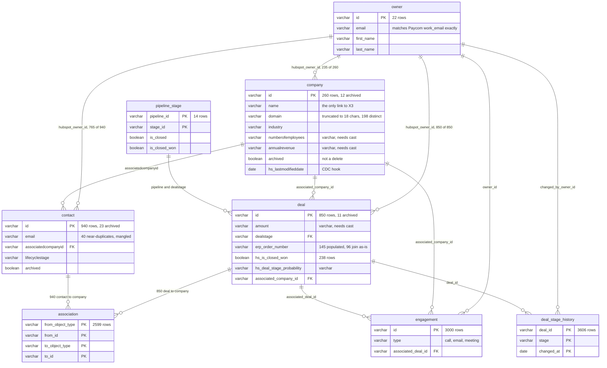

**What to look at.** company.name is the only candidate join to the ERP, and hubspot.owner.email is an exact match to Paycom's work_email — the best identity key in the estate, and not in the documented join map.

### Fig 2.3 — Paycom — payroll

*Flat report exports. Every date a string, every amount a string, and no change-tracking column anywhere.*

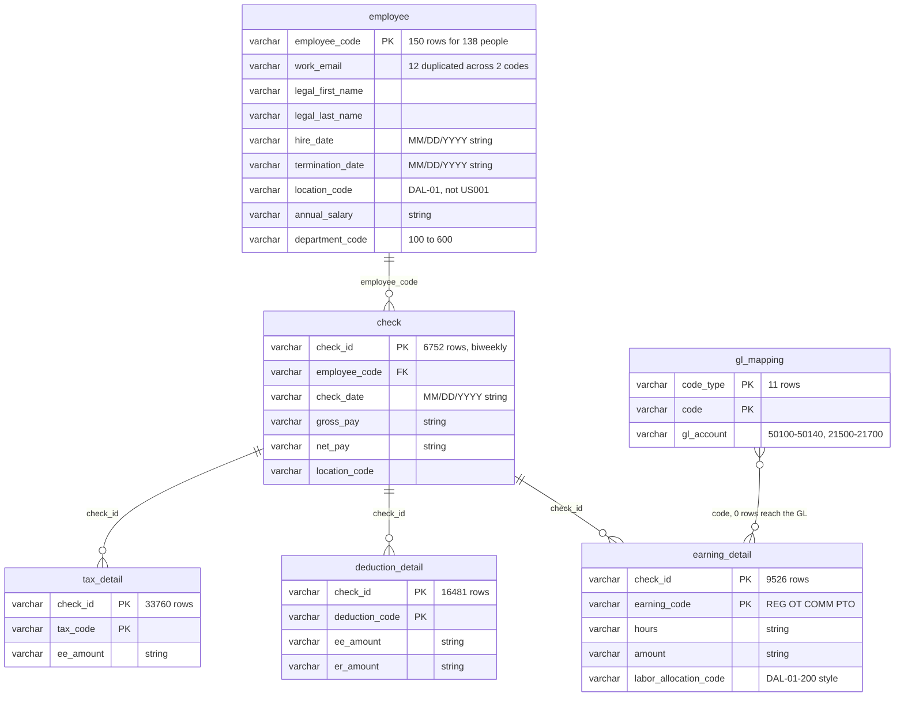

**What to look at.** employee_code is a primary key that does not identify a person: 12 emails appear twice with the same legal name and two different codes. gl_mapping is drawn as a solid line in the documented join map and is not one — none of its GL accounts exist in the ledger.

### Fig 2.4 — Netstock — demand planning

*Regenerated wholesale on each sync, with one last_sync_at across every row.*

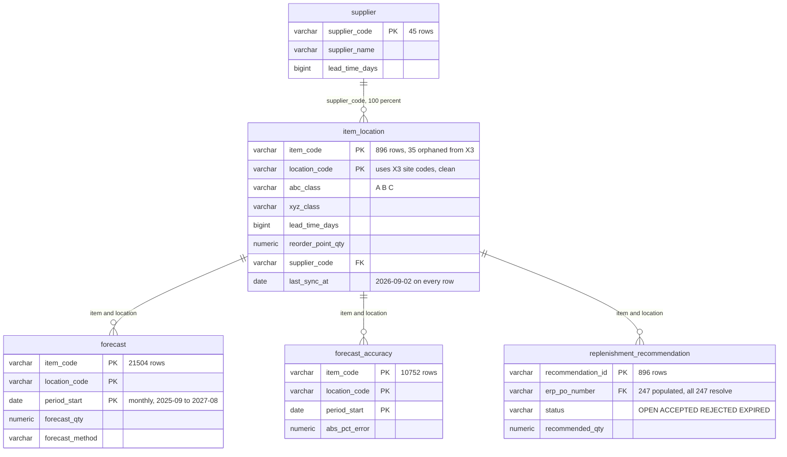

**What to look at.** replenishment_recommendation.erp_po_number is a clean cross-system link the documented join map does not mention: sparse at 247 of 896 rows, but 100% accurate where present. It is the only reliable path from planning back to procurement.

### Fig 2.5 — Pangea — freight visibility

*Product still unidentified, but the data is internally consistent with a freight platform.*

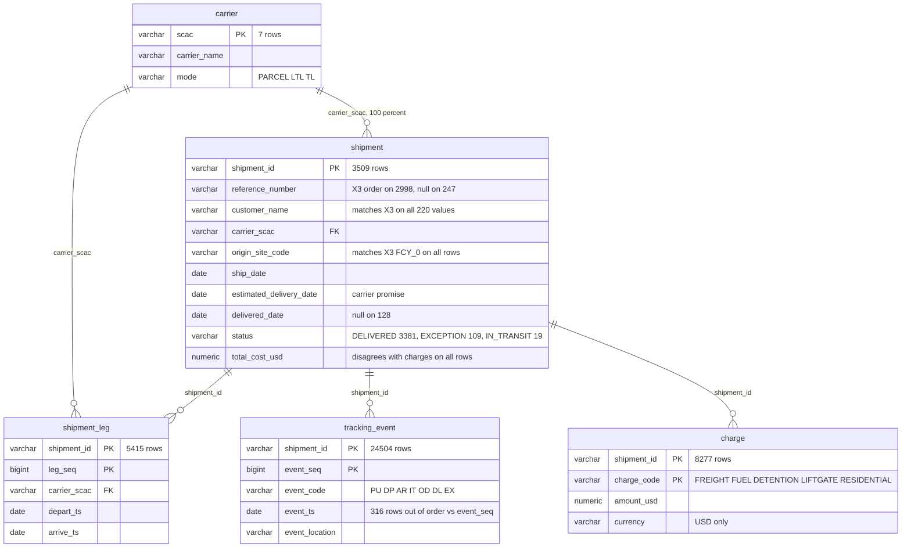

**What to look at.** Two structural facts drive everything built on top: the header cost and the charge lines never agree, and event timestamps are not monotonic in event_seq — so milestones are extracted by event code, never by earliest timestamp.

## §3 Where the systems meet

The part that matters for the design. Solid arrows are keys that resolve. Dashed arrows are the seams, and each one carries its measured cost.

### Fig 3.1 — The cross-system join map

*Three of the seven cross-system links are not in the documented join map, and two of those are the best keys available.*

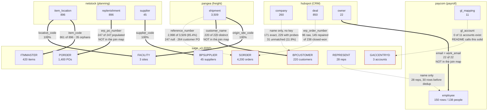

**What to look at.** The dashed lines are where the sprint goes. Tiered matching takes HubSpot-to-ERP customer coverage from 65.8% to 88.1%; repairing case, prefix and multi-value references takes the CRM-to-ERP handoff from 96 deals to 145.

## §4 The model the dashboards read

One conformed core, process-agnostic. Five dimensions, four atomic facts, and every fact-to-dimension relationship asserted by a test rather than assumed by the BI tool.

### Fig 4.1 — The dimensional model

*Five conformed dimensions and four atomic facts. Nine presentation views sit on top; none of them contain business logic.*

```mermaid
erDiagram
    dim_date ||--o{ fct_shipment : "ship_date_key"
    dim_date ||--o{ fct_shipment_event : "event_date_key"
    dim_date ||--o{ fct_sales_order_line : "order_date_key"
    dim_date ||--o{ fct_invoice_line : "invoice_date_key"

    dim_customer ||--o{ fct_shipment : "customer_key"
    dim_customer ||--o{ fct_shipment_event : "customer_key"
    dim_customer ||--o{ fct_sales_order_line : "customer_key"
    dim_customer ||--o{ fct_invoice_line : "customer_key"

    dim_site ||--o{ fct_shipment : "site_code"
    dim_site ||--o{ fct_shipment_event : "site_code"
    dim_site ||--o{ fct_sales_order_line : "site_code"
    dim_site ||--o{ fct_invoice_line : "site_code"

    dim_item ||--o{ fct_sales_order_line : "item_code"
    dim_item ||--o{ fct_invoice_line : "item_code"

    dim_carrier ||--o{ fct_shipment : "carrier_scac"
    dim_carrier ||--o{ fct_shipment_event : "carrier_scac"

    fct_shipment ||--o{ fct_shipment_event : "shipment_id"

    dim_date {
        integer date_key PK "1461 rows, 2024-2027"
        date date_day
        integer calendar_year
        integer calendar_quarter
        varchar fiscal_quarter_label "fiscal equals calendar, ASSUMED"
        boolean fiscal_equals_calendar "the assumption, visible"
        boolean is_past_as_of_build "named for what it is, not is_past"
        date built_on_date "so a stale value is visible"
    }
    dim_customer {
        varchar customer_key PK "252 rows incl UNKNOWN"
        varchar customer_code "X3, null for CRM-only"
        varchar hubspot_company_id "CRM, null for ERP-only"
        varchar customer_name "X3 survives"
        varchar payment_term_code "X3 survives"
        numeric credit_limit_amount "X3 survives"
        varchar primary_rep_name "X3 survives"
        varchar industry "HubSpot survives"
        double annual_revenue "HubSpot survives"
        varchar source_scope "both 197, erp 23, crm 31, unknown 1"
        decimal match_confidence "0.60 to 0.95"
        boolean match_is_ambiguous "15 rows"
        integer crm_company_count "makes the CRM denominator recoverable"
    }
    dim_site {
        varchar site_code PK "4 rows incl UNKNOWN"
        varchar site_name
        varchar paycom_location_code "via seed crosswalk"
        varchar netstock_location_code
        varchar company_name
    }
    dim_item {
        varchar item_code PK "421 rows incl UNKNOWN"
        varchar item_description "current, not order-time"
        varchar item_status "decoded from local menu"
        varchar best_abc_class "strongest class at any location"
        boolean is_planned_in_netstock "418 of 420"
    }
    dim_carrier {
        varchar carrier_scac PK "8 rows incl UNKNOWN"
        varchar carrier_name
        varchar transport_mode
        bigint shipment_count
    }
    fct_shipment {
        varchar shipment_id PK "3509 rows"
        integer ship_date_key FK
        varchar customer_key FK "resolved on 100 percent"
        varchar site_code FK
        varchar carrier_scac FK
        varchar sales_order_number "resolved on 85.4 percent"
        numeric shipment_cost_usd "resolves to var shipment_cost_basis"
        numeric header_cost_usd "the other basis"
        numeric cost_variance_usd "never zero"
        boolean is_on_time_vs_carrier_promise "75.6 percent"
        boolean is_on_time_vs_customer_request "84.1 percent"
        boolean has_order_reference
        boolean has_out_of_sequence_events "298 shipments"
    }
    fct_shipment_event {
        varchar shipment_id PK "24504 rows"
        bigint event_sequence PK
        varchar event_code
        date event_at "not event_date - a real feed sends a timestamp"
        integer days_since_previous_event
        boolean is_out_of_sequence "316 events"
    }
    fct_sales_order_line {
        varchar sales_order_number PK "11575 rows"
        bigint sales_order_line_number PK
        varchar customer_key FK
        varchar item_code FK
        numeric line_net_amount_doc "document currency"
        numeric line_net_amount_usd "reporting currency"
        decimal fx_rate "from int_fx_rate"
        boolean fx_rate_is_fallback "0 rows today"
    }
    fct_invoice_line {
        varchar invoice_number PK "9767 rows"
        bigint invoice_line_number PK
        varchar customer_key FK
        numeric line_net_amount_usd "sums to GL 41000 exactly"
        integer days_to_pay_settled_only "the only one - null, never zero, when unpaid"
        boolean is_unsettled "1335 lines, 13.7 percent"
    }
```

**What to look at.** dim_customer carries its own entity-resolution result: 197 matched across both systems, 23 ERP-only, 31 CRM companies with no ERP counterpart. Those 31 stay in the dimension, because dropping them would make the unmatched rate look like zero.

## §5 How one becomes the other

Extracted from the dbt manifest after a full build — this is what actually runs. 80 models across five layers, fed by 46 extraction resources.

### Fig 5.1 — The whole pipeline

*Source systems to exports, by layer, with what each layer is allowed to do.*

```mermaid
flowchart TB
    subgraph SYS["source systems"]
        y1["Sage X3<br/><i>SQL database read</i>"]
        y2["HubSpot<br/><i>REST + cursor</i>"]
        y3["Paycom<br/><i>SFTP report drop</i>"]
        y4["Netstock<br/><i>snapshot API</i>"]
        y5["Pangea<br/><i>REST + children</i>"]
    end

    subgraph ING["ingestion · dlt · 46 resources"]
        ext["extract<br/><br/>10 full refresh · 3 modified-date<br/>12 header-window · 5 API cursor<br/>5 snapshot · 6 file drop<br/><br/>schema contract enforced"]
        land[("landing/<br/>Parquet · append-only<br/>partitioned by load_date<br/><i>replayable · auditable</i>")]
    end

    subgraph SRC["raw.duckdb · 46 tables · 233,150 rows"]
        s1["sage_x3 · 22"]
        s2["hubspot · 8"]
        s3["paycom · 6"]
        s4["netstock · 5"]
        s5["pangea · 5"]
    end

    subgraph STG["staging · 46 models · generated"]
        stg["stg_&lt;source&gt;__&lt;table&gt;<br/><br/>trim · sentinel to null · cast<br/>parse dates · decode local menus<br/>flag archived, never filter<br/><br/>NO business logic"]
    end

    subgraph INT["intermediate · 8 models · hand-written"]
        i1["int_customer_xref"]
        i2["int_employee_xref"]
        i3["int_deal_erp_order_number"]
        i4["int_fx_rate"]
        i5["int_sales_order_line"]
        i6["int_shipment_order"]
        i7["int_shipment_charge"]
        i8["int_shipment_milestone"]
    end

    subgraph CORE["marts/core · 9 models · hand-written · THE data model"]
        d["dim_date · dim_customer · dim_site<br/>dim_item · dim_carrier"]
        f["fct_shipment · fct_shipment_event<br/>fct_sales_order_line · fct_invoice_line"]
    end

    subgraph SEM["semantic · 10 metric definitions · YAML"]
        reg["semantic/metrics/*.yml<br/>semantic/models.yml<br/>semantic/dimensions.yml<br/><br/>no process field"]
    end

    subgraph MTR["marts/metrics · 7 models · generated"]
        m["mtr_&lt;metric&gt;<br/>numerator + denominator by dimension"]
    end

    subgraph PROC["marts/process · 9 views · generated"]
        p["mart_o2c · mart_s2p · mart_i2d<br/>+ 6 empty and typed"]
    end

    subgraph OUT["exports"]
        o["Parquet · TMDL · DAX<br/>Cube schema · agent JSON"]
    end

    seed[("seeds<br/>process_metric_map<br/>site_code_crosswalk<br/>process · metric_registry")]

    SYS --> ext --> land -->|"projection: SQL only,<br/>no source access"| SRC
    SRC --> STG --> INT --> CORE
    CORE --> reg
    reg -->|"scripts/compile_metrics.py"| MTR
    reg -->|"scripts/compile_metrics.py"| OUT
    MTR --> PROC
    seed -->|"scripts/generate_process_views.py"| PROC
    seed --> CORE
    CORE --> OUT
    reg -->|"compile"| seed
```

**What to look at.** The two arrows leaving the semantic layer are the point of the design: one YAML definition generates both the warehouse SQL and the Power BI measures, so a dashboard and the database cannot disagree about what a metric means.

### Fig 5.2 — Shipment path

*The deepest chain in the project, carrying both computable metrics.*

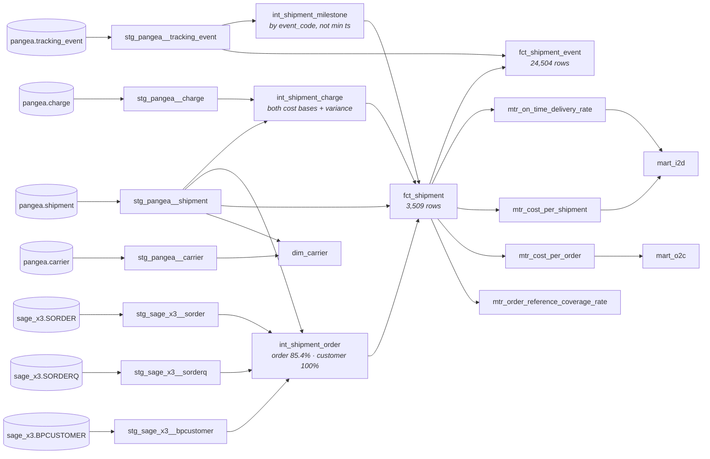

**What to look at.** fct_shipment feeds four metrics across two different dashboards. That is the conformed core doing its job — one shipment fact, not an I2D shipment fact and an O2C shipment fact.

### Fig 5.3 — Order-to-cash path

*X3's split line tables rejoined, and both money facts converted through one rate model.*

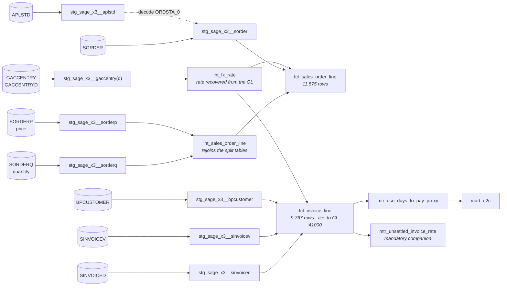

**What to look at.** int_fx_rate feeding both facts is what stops USD and CAD being added together by accident. Every monetary column exists twice, suffixed _doc and _usd.

### Fig 5.4 — Entity resolution

*Two crosswalks, one reference repair — and two models with nothing downstream of them.*

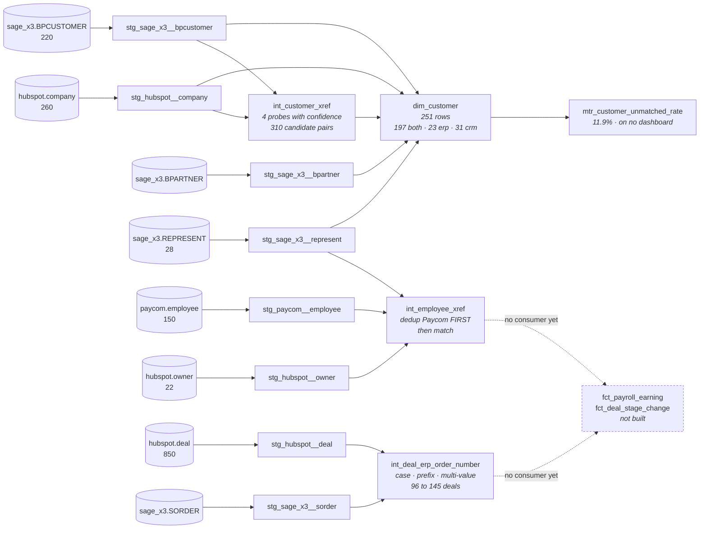

**What to look at.** int_employee_xref and int_deal_erp_order_number are built, tested and unconsumed. Their findings are governance results in their own right, and the resolution is ready for the first metric that needs it. The DAG shows the dead ends rather than hiding them.

### Fig 5.5 — Metric and dashboard generation

*The part with no dbt lineage, because the edges are scripts rather than model references.*

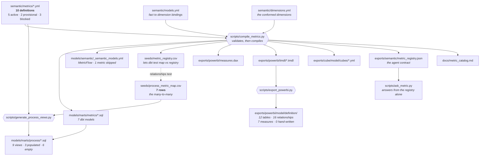

**What to look at.** The registry is compiled into a seed so dbt can enforce referential integrity between the dashboard map and the metric definitions. A typo fails the build instead of producing an empty tile.

---

Rebuild this page with `python scripts/build_atlas.py docs/atlas.md`.
