# Entity relationships and pipeline

Three views of the same system:

1. **[Source ERDs](#1-source-erds)** — what the five source systems look like, and
   which of their relationships actually hold.
2. **[Cross-system ERD](#2-cross-system-erd)** — where the systems touch, which
   of those seams are reliable, and the measured cost of the ones that are not.
3. **[The dimensional model](#3-the-dimensional-model)** — the star schema the
   dashboards are built on.
4. **[Pipeline DAGs](#4-pipeline-dags)** — how one becomes the other.

Every cardinality and every match rate on this page was measured against
`mock_sources.duckdb` (SEED 20260905) or read out of `target/manifest.json`.
Nothing here is drawn from the schema alone. Reproduce with
`python scripts/profile_sources.py`.

Diagrams render on GitHub and in any Mermaid-aware viewer. For the interactive
version of the DAGs, `dbt docs generate && dbt docs serve`.

---

## 1. Source ERDs

### 1.1 Sage X3 (ERP) — high fidelity

The ERP is where the transactional volume lives, and its internal referential
integrity is near-perfect: every relationship below resolves 100% **after
trimming**, except the return-to-order reference, which is keyed by hand.
Two things to notice in the diagram — `SORDERQ`/`SORDERP` split one logical
order line across two physical tables, and `APLSTD` is a generic enum table that
every status column resolves through.

```mermaid
erDiagram
    COMPANY ||--o{ FACILITY : "LEGCPY_0"
    FACILITY ||--o{ ITMFACILIT : "STOFCY_0"
    FACILITY ||--o{ SORDER : "SALFCY_0"
    FACILITY ||--o{ PORDER : "POHFCY_0"
    FACILITY ||--o{ GACCENTRY : "FCY_0"
    FACILITY ||--o{ STOCK : "STOFCY_0"
    FACILITY ||--o{ STOJOU : "STOFCY_0"
    FACILITY ||--o{ REPRESENT : "FCY_0"

    BPARTNER ||--o| BPCUSTOMER : "220 of 265"
    BPARTNER ||--o| BPSUPPLIER : "45 of 265"
    BPARTNER ||--o{ BPADDRESS : "BPANUM_0"
    BPARTNER ||--o{ GACCENTRYD : "BPR_0"

    REPRESENT ||--o{ BPCUSTOMER : "REP_0 and REP_1"
    REPRESENT ||--o{ SORDER : "REP_0 and REP_1"

    ITMMASTER ||--o{ ITMFACILIT : "ITMREF_0"
    ITMMASTER ||--o{ SORDERQ : "trim needed"
    ITMMASTER ||--o{ SORDERP : "trim needed"
    ITMMASTER ||--o{ SINVOICED : "ITMREF_0"
    ITMMASTER ||--o{ PORDERQ : "ITMREF_0"
    ITMMASTER ||--o{ STOCK : "ITMREF_0"
    ITMMASTER ||--o{ STOJOU : "trim needed"
    ITMMASTER ||--o{ ATEXTRA : "IDENT1_0"

    BPCUSTOMER ||--o{ SORDER : "BPCORD_0 trim needed"
    BPCUSTOMER ||--o{ SINVOICEV : "BPR_0"
    BPSUPPLIER ||--o{ PORDER : "BPSNUM_0"

    SORDER ||--o{ SORDERQ : "quantity side"
    SORDER ||--o{ SORDERP : "price side"
    SORDER ||--o{ STOJOU : "VCRNUM_0 where SDH"
    SORDERQ ||--o| SINVOICED : "SOHNUM_0 and SOPLIN_0"

    SINVOICEV ||--o{ SINVOICED : "NUM_0"
    SINVOICEV ||--o| GACCENTRY : "VCRNUM_0"

    PORDER ||--o{ PORDERQ : "POHNUM_0"
    GACCENTRY ||--o{ GACCENTRYD : "NUM_0"

    BPCUSTOMER ||--o{ SRETURN : "BPCNUM_0"
    SRETURN ||--o{ SRETURND : "SRHNUM_0"
    SORDERQ ||--o{ SRETURND : "order line, 8 percent unresolvable"
    SINVOICEV ||--o| SRETURN : "SIVNUM_0 credit memo, 14 percent pending"

    BPSUPPLIER ||--o{ PRECEIPT : "BPSNUM_0"
    PRECEIPT ||--o{ PRECEIPTD : "PTHNUM_0"
    PORDERQ ||--o{ PRECEIPTD : "POHNUM_0 and POPLIN_0"
    PRECEIPT ||--o{ STOJOU : "VCRNUM_0 where PTH"

    BPSUPPLIER ||--o{ PINVOICE : "BPSNUM_0"
    PINVOICE ||--o{ PINVOICED : "NUM_0"
    PORDERQ ||--o{ PINVOICED : "PO line, may be null"
    PRECEIPTD ||--o{ PINVOICED : "PTHNUM_0, may be null"
    PINVOICE ||--o| GACCENTRY : "PUR journal"

    FACILITY ||--o{ STOCOUNT : "STOFCY_0"
    STOCOUNT ||--o{ STOCOUNTD : "SESNUM_0"
    ITMMASTER ||--o{ STOCOUNTD : "ITMREF_0"

    APLSTD ||--o{ ITMMASTER : "chapter 20 ITMSTA_0"
    APLSTD ||--o{ SORDER : "chapter 415 ORDSTA_0"
    APLSTD ||--o{ PORDER : "chapter 415 ORDSTA_0"
    APLSTD ||--o{ STOJOU : "chapter 700 TRSTYP_0"
    APLSTD ||--o{ ITMFACILIT : "chapter 861 REOMODE_0"

    COMPANY {
        varchar CPY_0 PK "2 rows: GLBUS, GLBCA"
        varchar CPYNAM_0
        varchar CRY_0
    }
    FACILITY {
        varchar FCY_0 PK "3 rows: US001 US002 CA001"
        varchar LEGCPY_0 FK
        varchar FCYNAM_0
        varchar CTY_0
    }
    BPARTNER {
        varchar BPRNUM_0 PK "265 rows"
        varchar BPRNAM_0
        bigint BPCFLG_0 "2 means customer"
        bigint BPSFLG_0 "2 means supplier"
        varchar CUR_0 "USD 229, CAD 36"
        bigint UPDTICK_0 "CDC hook"
    }
    BPCUSTOMER {
        varchar BPCNUM_0 PK "220 rows"
        varchar BPCNAM_0 "only link to HubSpot"
        varchar CUR_0
        varchar PTE_0 "payment terms"
        numeric BPCSNC_0 "credit limit"
        varchar REP_0 FK "array position 0"
        varchar REP_1 FK "array position 1, 41 rows"
    }
    BPSUPPLIER {
        varchar BPSNUM_0 PK "45 rows"
        varchar BPSNAM_0
        bigint LTI_0 "lead time days"
    }
    BPADDRESS {
        varchar BPANUM_0 PK "321 rows"
        varchar BPAADD_0 PK "multiple ship-tos"
        varchar CTY_0
    }
    REPRESENT {
        varchar REPNUM_0 PK "28 rows"
        varchar REPNAM_0 "LASTNAME FIRSTNAME"
        varchar FCY_0 FK
    }
    ITMMASTER {
        varchar ITMREF_0 PK "420 rows, NOT padded"
        varchar ITMDES1_0
        varchar TCLCOD_0 "category"
        bigint ITMSTA_0 "local menu ch 20"
        numeric BASPRI_0
        bigint UPDTICK_0 "CDC hook"
    }
    ITMFACILIT {
        varchar ITMREF_0 PK "886 rows"
        varchar STOFCY_0 PK
        bigint REOMODE_0 "local menu ch 861"
        numeric SAFSTO_0
    }
    SORDER {
        varchar SOHNUM_0 PK "4200 rows"
        varchar BPCORD_0 FK "CHAR-padded, all rows"
        varchar SALFCY_0 FK
        date ORDDAT_0
        date SHIDAT_0 "402 rows carry 1753-01-01"
        bigint ORDSTA_0 "local menu ch 415"
        varchar CUR_0 "USD 3512, CAD 688"
        varchar REP_0 FK
    }
    SORDERQ {
        varchar SOHNUM_0 PK "11575 rows"
        bigint SOPLIN_0 PK
        varchar ITMREF_0 FK "CHAR-padded, all rows"
        numeric QTY_0
        date DEMDLVDAT_0 "customer request date"
        numeric SHTQTY_0
    }
    SORDERP {
        varchar SOHNUM_0 PK "11575 rows"
        bigint SOPLIN_0 PK
        varchar ITMREF_0 FK "CHAR-padded, agrees with SORDERQ"
        varchar ITMDES1_0 "denormalised at order time"
        numeric NETPRI_0
        numeric AMTNOTLIN_0
    }
    SINVOICEV {
        varchar NUM_0 PK "3691 rows"
        varchar BPR_0 FK
        date INVDAT_0
        date PAYDAT_0 "492 invoices carry 1753-01-01"
        varchar SIVTYP_0 "SIN 3564, SCR 127 credit memos"
        numeric AMTNOTLIN_0
    }
    SINVOICED {
        varchar NUM_0 PK "9923 rows"
        bigint SIDLIN_0 PK
        varchar SOHNUM_0 FK "all 9767 invoice lines resolve"
        bigint SOPLIN_0 FK
        numeric AMTNOTLIN_0 "reconciles to GL 41000"
    }
    PORDER {
        varchar POHNUM_0 PK "1400 rows"
        varchar BPSNUM_0 FK
        bigint ORDSTA_0 "local menu ch 415"
    }
    PORDERQ {
        varchar POHNUM_0 PK "2959 rows"
        bigint POPLIN_0 PK
        numeric RCPQTY_0 "copy of the LAST receipt only"
        date RCPDAT_0 "576 rows carry 1753-01-01"
    }
    STOCK {
        varchar STOFCY_0 PK "1315 rows, current only"
        varchar ITMREF_0 PK
        varchar LOT_0 PK
        varchar LOC_0 PK
        numeric QTYSTU_0
    }
    STOJOU {
        bigint ROWID PK "14226 rows"
        varchar ITMREF_0 FK "CHAR-padded, all rows"
        bigint TRSTYP_0 "local menu ch 700, 6 is customer return"
        varchar VCRTYP_0 "SDH PTH SRH ADJ TRF"
        varchar VCRNUM_0 "resolves to its document"
        numeric QTYSTU_0
    }
    GACCENTRY {
        varchar NUM_0 PK "4877 rows"
        varchar JOU_0 "SAL sales, PUR purchasing"
        varchar TYP_0 "SIH SCH PIH"
        varchar VCRNUM_0 FK "the invoice or credit memo"
        varchar CUR_0
    }
    GACCENTRYD {
        varchar NUM_0 PK "14631 rows"
        bigint LIN_0 PK
        varchar ACC_0 "11100 21000 22300 41000 50000"
        numeric AMTCUR_0 "document currency"
        numeric AMTLOC_0 "company currency, implies FX"
    }
    SRETURN {
        varchar SRHNUM_0 PK "146 rows"
        varchar BPCNUM_0 FK
        date RTNDAT_0 "the return date, not the order date"
        varchar SIVNUM_0 FK "credit memo, null until credited"
    }
    SRETURND {
        varchar SRHNUM_0 PK "179 rows"
        bigint SRDLIN_0 PK
        varchar SOHNUM_0 FK "8 percent blank or lowercased"
        bigint SOPLIN_0 FK
        numeric AMTNOTLIN_0
    }
    PRECEIPT {
        varchar PTHNUM_0 PK "1743 rows"
        varchar POHNUM_0 FK
        varchar BPSNUM_0 FK
        date RCPDAT_0 "a document with its own date"
    }
    PRECEIPTD {
        varchar PTHNUM_0 PK "2664 rows"
        bigint PTDLIN_0 PK
        varchar POHNUM_0 FK
        bigint POPLIN_0 FK "multi-delivery lines split here"
        numeric QTYUOM_0
    }
    PINVOICE {
        varchar NUM_0 PK "1186 rows"
        varchar BPSNUM_0 FK
        date INVDAT_0
        varchar INVSTA_0
    }
    PINVOICED {
        varchar NUM_0 PK "2498 rows"
        bigint PIDLIN_0 PK
        varchar POHNUM_0 FK "null means no PO"
        varchar PTHNUM_0 FK "null means not received"
        numeric QTY_0
        numeric NETPRI_0
    }
    STOCOUNT {
        varchar SESNUM_0 PK "78 sessions, name constructed"
        varchar STOFCY_0 FK
        date CNTDAT_0
    }
    STOCOUNTD {
        varchar SESNUM_0 PK "2843 counted positions"
        bigint CNTLIN_0 PK
        varchar ITMREF_0 FK
        numeric QTYTHEO_0 "system qty AT COUNT TIME"
        numeric QTYCNT_0
    }
    APLSTD {
        bigint CHAPTER_0 PK "28 rows"
        bigint CODE_0 PK
        varchar LANNUM_0 PK
        varchar TEXTE_0
    }
    ATEXTRA {
        varchar CODFIC_0 PK "148 rows"
        varchar ZONE_0 PK
        varchar LANNUM_0 PK "FRA translations"
        varchar IDENT1_0 PK
    }
```

**What the diagram is telling you**

- **Every X3 join resolves 100% after `trim()`.** The `trim needed` labels are
  not warnings about data quality — they are warnings about *your SQL*. Without
  the trim, `SORDERQ → ITMMASTER` returns **zero rows**, not fewer rows.
- **`SORDERQ ||--o| SINVOICED` is one-to-at-most-one.** All 9,767 invoice lines
  resolve to an order line, no order line is invoiced twice, and 9,767 of the
  11,575 order lines have been invoiced. The 156 credit-memo lines carry no
  order line; returns reach the order through `SRETURND` instead.
  Order-to-cash is fully traceable inside X3.
- **Every `STOJOU` movement resolves to the document that caused it.** The
  10,421 `SDH` (shipment) rows resolve to a `SORDER`, and all 2,664 `PTH`
  (receipt) rows resolve to a `PRECEIPT`. Receipts are documents in their own
  right, which is what makes a three-way match possible: `PORDERQ.RCPQTY_0` is
  only a copy of the *last* receipt, and matching against it treats every
  partial delivery as a variance.
- **The GL has sales and purchasing, and nothing else.** Two journals (`SAL`,
  `PUR`) and five accounts — AR 11100, AP 21000, tax 22300, revenue 41000,
  purchases 50000. There is no COGS, no operating expense and no payroll, which
  caps Cost Per Order at a fulfillment-only pool.
- **Returns are keyed by hand.** 8% of `SRETURND.SOHNUM_0` values are blank or
  lowercased, and 14% of returns have no credit memo yet. Both are carried
  rather than cleaned — see Return Rate in
  [metric_feasibility.md](metric_feasibility.md).

### 1.2 HubSpot (CRM) — connector landing

Shaped like a Fivetran/Airbyte landing: properties as strings, associations as
a separate many-to-many, `archived` instead of deletes. Note that
`association` duplicates what the denormalised `*_id` columns on `deal` and
`contact` already carry — both are present, as they would be in a real landing.

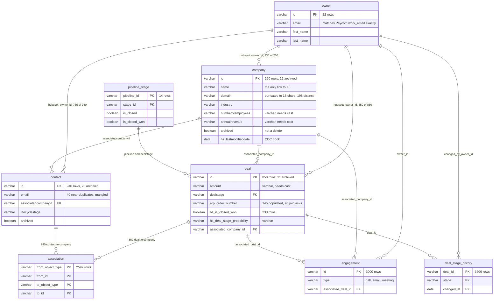

The 25 companies and 175 contacts with no owner are not an integrity failure —
`hubspot_owner_id` is genuinely optional in HubSpot. The 12 archived companies
are flagged in staging and left for the mart to decide about.

### 1.3 Paycom (payroll) — flat report exports

Paycom has no queryable backend, so this is modelled as report exports and that
is the real constraint. Every date is a `MM/DD/YYYY` string, every amount is a
string, and there is **no change-tracking column anywhere** — so ingestion is
full refresh, unlike X3 and HubSpot.

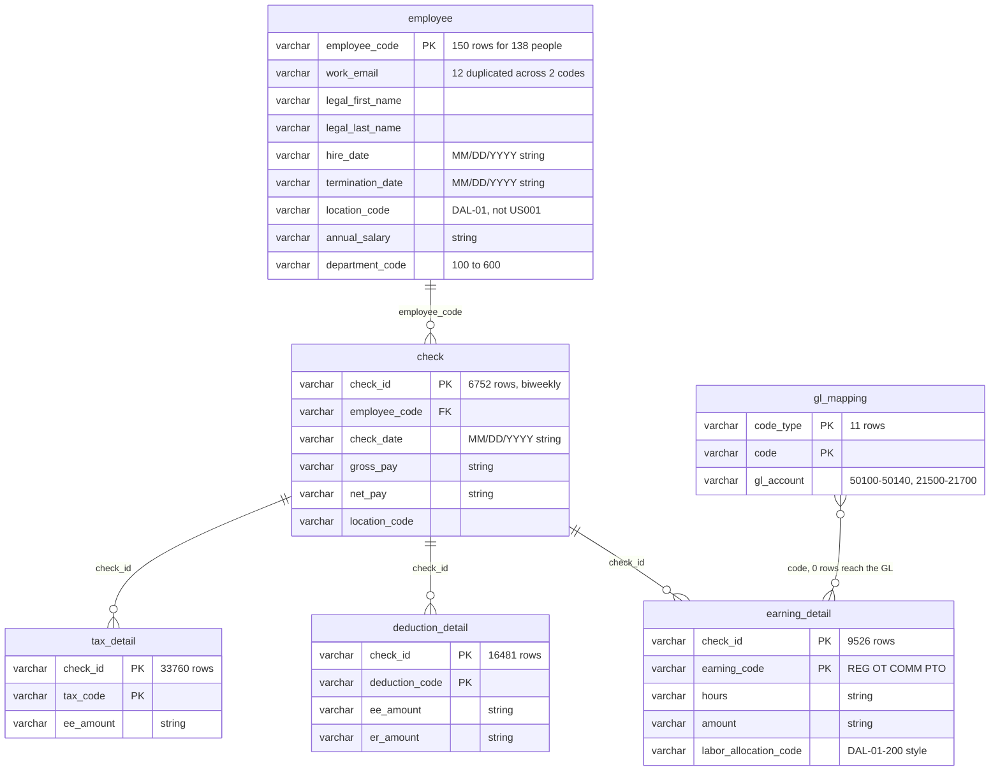

Two findings sit in this diagram:

- **`employee_code` is a primary key that does not identify a person.** 12
  emails appear twice with the same legal name and two different codes. The
  roster describes 138 people. This breaks both candidate cross-system keys and
  is why `int_employee_xref` deduplicates before it matches.
- **`gl_mapping` is drawn as a solid line in the README's join map and it is
  not one.** None of its 11 GL accounts exist in `GACCENTRYD`, which holds only
  11100, 21000, 22300, 41000 and 50000. Payroll is not posted to the general
  ledger in this extract.

### 1.4 Netstock (demand planning) — inferred

Regenerated wholesale on each sync with a single `last_sync_at` of 2026-09-02,
so the natural landing pattern is a snapshot fact rather than an SCD.

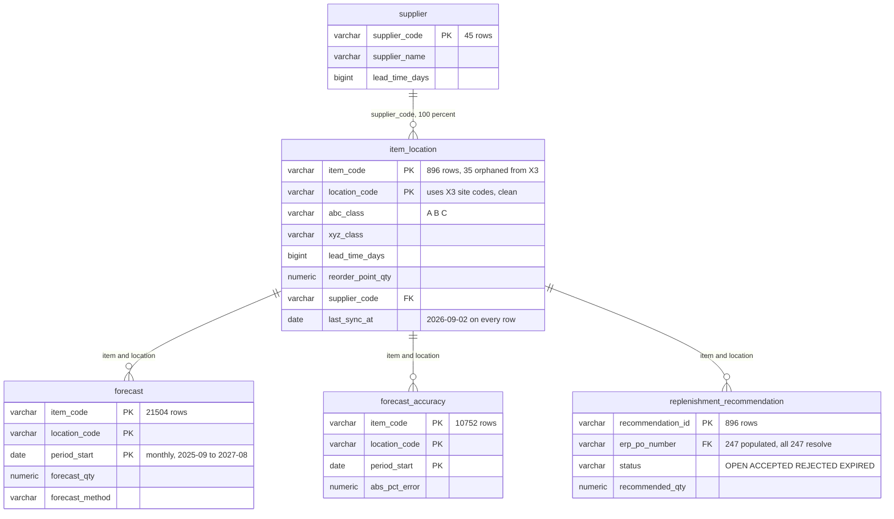

`replenishment_recommendation.erp_po_number` is a **clean cross-system link
that the README's join map does not mention** — sparse (247 of 896) but 100%
accurate where present, and spread across all four statuses rather than only
`ACCEPTED`. It is the only reliable path from planning back to procurement.

### 1.5 Pangea (freight visibility) — inferred, product unconfirmed

The product identity is a guess (open question 9). The data is internally
consistent with a freight/parcel visibility platform: SCAC-keyed carriers,
PARCEL/LTL/TL modes, tracking events, accessorial charges.

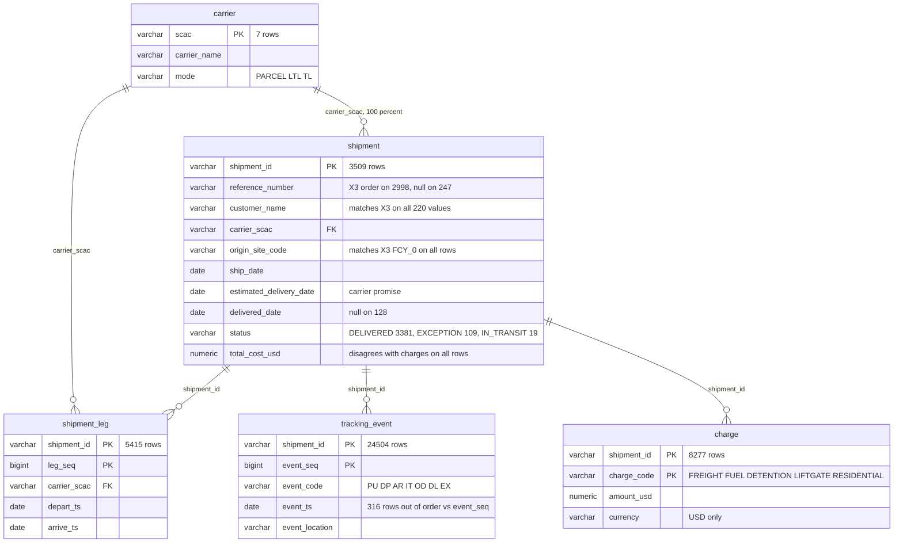

Two structural facts drive the model built on top of this:

- **`total_cost_usd` and `sum(charge.amount_usd)` never agree.** Not on one of
  3,509 shipments; only 30 agree within a dollar; the header is 9.9% higher in
  aggregate. `int_shipment_charge` computes both and publishes the variance.
- **`event_ts` is not monotonic in `event_seq`.** 316 events (1.29%) across 298
  shipments arrive out of order, so milestones are extracted by `event_code`,
  never by `min`/`max` of the timestamp.

---

## 2. Cross-system ERD

This is the part that matters for the design. **Solid lines resolve cleanly.
Dashed lines are the seams** — and every one of them has a measured cost.

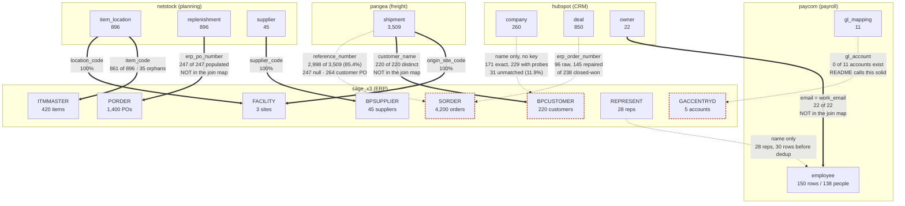

Read with the arrows: `==>` is a reliable key, `-.->` is a seam that needs a
resolution strategy.

| Seam | Raw | After the work in `intermediate/` | Where |
|---|---|---|---|
| HubSpot company → X3 customer | 171 of 260 (65.8%) | **229 (88.1%)**, 15 ambiguous, 31 unmatched | `int_customer_xref` |
| HubSpot deal → X3 order | 96 of 145 | **145 of 145** (every deal carrying a reference) | `int_deal_erp_order_number` |
| Pangea shipment → X3 order | 2,998 of 3,509 (85.4%) | 85.4% for the order; **100% for the customer** via `customer_name` | `int_shipment_order` |
| X3 rep → Paycom employee | 30 rows for 28 reps | **28 unambiguous**, after deduplicating Paycom first | `int_employee_xref` |
| Paycom GL → X3 GL | 0 of 11 | Still 0. Not fixable here — it is a finding | warn test, threshold 11 |

Three of the seven links above are **not in the README's join map** and two of
them are the best keys available in the estate. The `hubspot.owner.email =
paycom.employee.work_email` link in particular is exact, where the documented
name-based path is not.

---

## 3. The dimensional model

Star schema. Five conformed dimensions, six atomic facts, all in
`marts/core/`. Process-agnostic by design — nothing in this layer knows what a
dashboard is.

```mermaid
erDiagram
    dim_date ||--o{ fct_shipment : "ship_date_key"
    dim_date ||--o{ fct_shipment_event : "event_date_key"
    dim_date ||--o{ fct_sales_order_line : "order_date_key"
    dim_date ||--o{ fct_invoice_line : "invoice_date_key"
    dim_date ||--o{ fct_supplier_invoice_line : "invoice_date_key"
    dim_date ||--o{ fct_inventory_count_line : "count_date_key"

    dim_site ||--o{ fct_supplier_invoice_line : "site_code"
    dim_site ||--o{ fct_inventory_count_line : "site_code"
    dim_item ||--o{ fct_supplier_invoice_line : "item_code"
    dim_item ||--o{ fct_inventory_count_line : "item_code"

    dim_customer ||--o{ fct_shipment : "customer_key"
    dim_customer ||--o{ fct_shipment_event : "customer_key"
    dim_customer ||--o{ fct_sales_order_line : "customer_key"
    dim_customer ||--o{ fct_invoice_line : "customer_key"

    dim_site ||--o{ fct_shipment : "site_code"
    dim_site ||--o{ fct_shipment_event : "site_code"
    dim_site ||--o{ fct_sales_order_line : "site_code"
    dim_site ||--o{ fct_invoice_line : "site_code"

    dim_item ||--o{ fct_sales_order_line : "item_code"
    dim_item ||--o{ fct_invoice_line : "item_code"

    dim_carrier ||--o{ fct_shipment : "carrier_scac"
    dim_carrier ||--o{ fct_shipment_event : "carrier_scac"

    fct_shipment ||--o{ fct_shipment_event : "shipment_id"

    dim_date {
        integer date_key PK "1461 rows, 2024-2027"
        date date_day
        integer calendar_year
        integer calendar_quarter
        varchar fiscal_quarter_label "fiscal equals calendar, ASSUMED"
        boolean fiscal_equals_calendar "the assumption, visible"
        boolean is_past_as_of_build "named for what it is, not is_past"
        date built_on_date "so a stale value is visible"
    }
    dim_customer {
        varchar customer_key PK "252 rows incl UNKNOWN"
        varchar customer_code "X3, null for CRM-only"
        varchar hubspot_company_id "CRM, null for ERP-only"
        varchar customer_name "X3 survives"
        varchar payment_term_code "X3 survives"
        numeric credit_limit_amount "X3 survives"
        varchar primary_rep_name "X3 survives"
        varchar industry "HubSpot survives"
        double annual_revenue "HubSpot survives"
        varchar source_scope "both 197, erp 23, crm 31, unknown 1"
        decimal match_confidence "0.60 to 0.95"
        boolean match_is_ambiguous "15 rows"
        integer crm_company_count "makes the CRM denominator recoverable"
    }
    dim_site {
        varchar site_code PK "4 rows incl UNKNOWN"
        varchar site_name
        varchar paycom_location_code "via seed crosswalk"
        varchar netstock_location_code
        varchar company_name
    }
    dim_item {
        varchar item_code PK "421 rows incl UNKNOWN"
        varchar item_description "current, not order-time"
        varchar item_status "decoded from local menu"
        varchar best_abc_class "strongest class at any location"
        boolean is_planned_in_netstock "418 of 420"
    }
    dim_carrier {
        varchar carrier_scac PK "8 rows incl UNKNOWN"
        varchar carrier_name
        varchar transport_mode
        bigint shipment_count
    }
    fct_shipment {
        varchar shipment_id PK "3509 rows"
        integer ship_date_key FK
        varchar customer_key FK "resolved on 100 percent"
        varchar site_code FK
        varchar carrier_scac FK
        varchar sales_order_number "resolved on 85.4 percent"
        numeric shipment_cost_usd "resolves to var shipment_cost_basis"
        numeric header_cost_usd "the other basis"
        numeric cost_variance_usd "never zero"
        boolean is_on_time_vs_carrier_promise "75.6 percent"
        boolean is_on_time_vs_customer_request "84.1 percent"
        boolean has_order_reference
        boolean has_out_of_sequence_events "298 shipments"
    }
    fct_shipment_event {
        varchar shipment_id PK "24504 rows"
        bigint event_sequence PK
        varchar event_code
        date event_at "not event_date - a real feed sends a timestamp"
        integer days_since_previous_event
        boolean is_out_of_sequence "316 events"
    }
    fct_sales_order_line {
        varchar sales_order_number PK "11575 rows"
        bigint sales_order_line_number PK
        varchar customer_key FK
        varchar item_code FK
        numeric line_net_amount_doc "document currency"
        numeric line_net_amount_usd "reporting currency"
        decimal fx_rate "from int_fx_rate"
        boolean fx_rate_is_fallback "0 rows today"
    }
    fct_invoice_line {
        varchar invoice_number PK "9923 rows incl credit memos"
        bigint invoice_line_number PK
        varchar customer_key FK
        numeric line_net_amount_usd "reconciles to GL 41000"
        integer days_to_pay_settled_only "the only one - null, never zero, when unpaid"
        boolean is_unsettled "1372 lines, 13.8 percent"
    }
    fct_supplier_invoice_line {
        varchar supplier_invoice_number PK "2498 rows"
        bigint supplier_invoice_line_number PK
        integer invoice_date_key FK
        varchar site_code FK
        varchar item_code FK
        varchar receipt_number "the receipt it names, not every receipt"
        varchar match_result "matched 1766, price 295, qty 274, not received 107, no PO 56"
        boolean is_three_way_matched "70.7 percent"
        boolean is_maverick_spend
    }
    fct_inventory_count_line {
        varchar count_session_number PK "2843 rows"
        bigint count_line_number PK
        integer count_date_key FK
        varchar site_code FK
        varchar item_code FK
        numeric system_qty "at count time"
        numeric counted_qty
        boolean is_accurate_position "93.4 percent"
    }
```

**Grain, stated once**

| Model | One row is | Rows |
|---|---|---|
| `dim_date` | one calendar day | 1,461 |
| `dim_customer` | one conformed customer | 252 |
| `dim_site` | one site | 4 |
| `dim_item` | one item | 421 |
| `dim_carrier` | one carrier SCAC | 8 |
| `fct_shipment` | one shipment | 3,509 |
| `fct_shipment_event` | one tracking event on one shipment | 24,504 |
| `fct_sales_order_line` | one sales order line | 11,575 |
| `fct_invoice_line` | one sales invoice or credit-memo line | 9,923 |
| `fct_supplier_invoice_line` | one supplier invoice line | 2,498 |
| `fct_inventory_count_line` | one counted stock position | 2,843 |

Every one of the 22 fact-to-dimension relationships above is asserted by a dbt
`relationships` test, so the Power BI model is not relying on the tool to
discover a join that does not hold.

**Every dimension except `dim_date` carries an UNKNOWN member**, and every fact
coalesces its foreign keys to it — which is why the row counts are one above
the natural entity count. Without it an unresolved key lands as null:
`relationships` ignores nulls so it still passes, `not_null` on the fact starts
failing the build, and Power BI collects the rows on a blank member that reads
to a user as real. `dim_date` is the exception on purpose — an integer date key
has no sentinel that is not also a plausible date, and a fact with no date has
no place on a time series rather than an unknown one.

**Facts named but not built.** Grain decided once so it is not rediscovered
later: `fct_inventory_movement` (`STOJOU.ROWID`), `fct_inventory_balance` (item
× site × lot snapshot), `fct_purchase_order_line` (`POHNUM_0` + `POPLIN_0`),
`fct_gl_entry_line` (`NUM_0` + `LIN_0`), `fct_forecast` (item × location ×
period snapshot), `fct_deal_stage_change` (`deal_id` + transition),
`fct_payroll_earning` (`check_id` + `earning_code`). No active metric needs
them.

---

## 4. Pipeline DAGs

Extracted from `target/manifest.json` — this is what actually builds, not a
sketch. Five layers, fed by 54 dlt extraction resources. See
[ingestion.md](ingestion.md) for the extraction spec and its pitfalls.

### 4.1 The whole pipeline, by layer

```mermaid
flowchart TB
    subgraph SYS["source systems"]
        y1["Sage X3<br/><i>SQL database read</i>"]
        y2["HubSpot<br/><i>REST + cursor</i>"]
        y3["Paycom<br/><i>SFTP report drop</i>"]
        y4["Netstock<br/><i>snapshot API</i>"]
        y5["Pangea<br/><i>REST + children</i>"]
    end

    subgraph ING["ingestion · dlt · 54 resources"]
        ext["extract<br/><br/>15 full refresh · 3 modified-date<br/>20 header-window · 5 API cursor<br/>5 snapshot · 6 file drop<br/><br/>schema contract enforced"]
        land[("landing/<br/>Parquet · append-only<br/>partitioned by load_date<br/><i>replayable · auditable</i>")]
    end

    subgraph SRC["raw.duckdb · 54 tables · 247,851 rows"]
        s1["sage_x3 · 30"]
        s2["hubspot · 8"]
        s3["paycom · 6"]
        s4["netstock · 5"]
        s5["pangea · 5"]
    end

    subgraph STG["staging · 54 models · generated"]
        stg["stg_&lt;source&gt;__&lt;table&gt;<br/><br/>trim · sentinel to null · cast<br/>parse dates · decode local menus<br/>flag archived, never filter<br/><br/>NO business logic"]
    end

    subgraph INT["intermediate · 10 models · hand-written"]
        i1["int_customer_xref"]
        i2["int_employee_xref"]
        i3["int_deal_erp_order_number"]
        i4["int_fx_rate"]
        i5["int_sales_order_line"]
        i6["int_shipment_order"]
        i7["int_shipment_charge"]
        i8["int_shipment_milestone"]
        i9["int_sales_return_line"]
        i10["int_supplier_invoice_match"]
    end

    subgraph CORE["marts/core · 11 models · hand-written · THE data model"]
        d["dim_date · dim_customer · dim_site<br/>dim_item · dim_carrier"]
        f["fct_shipment · fct_shipment_event<br/>fct_sales_order_line · fct_invoice_line<br/>fct_supplier_invoice_line · fct_inventory_count_line"]
    end

    subgraph SEM["semantic · 10 metric definitions · YAML"]
        reg["semantic/metrics/*.yml<br/>semantic/models.yml<br/>semantic/dimensions.yml<br/><br/>no process field"]
    end

    subgraph MTR["marts/metrics · 10 models · generated"]
        m["mtr_&lt;metric&gt;<br/>numerator + denominator by dimension"]
    end

    subgraph PROC["marts/process · 9 views · generated"]
        p["mart_o2c · mart_s2p · mart_i2d<br/>+ 6 empty and typed"]
    end

    subgraph OUT["exports"]
        o["Parquet · TMDL model with DAX measures<br/>agent JSON"]
    end

    seed[("seeds<br/>process_metric_map<br/>site_code_crosswalk<br/>process · metric_registry")]

    SYS --> ext --> land -->|"projection: SQL only,<br/>no source access"| SRC
    SRC --> STG --> INT --> CORE
    CORE --> reg
    reg -->|"scripts/compile_metrics.py"| MTR
    reg -->|"scripts/export_powerbi.py"| OUT
    MTR --> PROC
    seed -->|"scripts/generate_process_views.py"| PROC
    seed --> CORE
    CORE --> OUT
    reg -->|"compile"| seed
```

The two arrows out of `semantic/` are the point of the whole design: the same
YAML produces the warehouse SQL *and* the Power BI measures, so they cannot
drift.

### 4.2 Shipment path — On-Time Delivery, Cost Per Shipment, Cost Per Order

The deepest chain in the project.

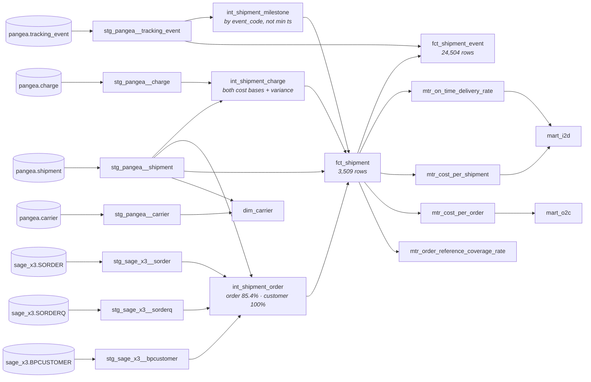

Note `fct_shipment` feeds four metrics across **two different dashboards**.
That is the conformed core doing its job — one shipment fact, not an I2D
shipment fact and an O2C shipment fact.

### 4.3 Order-to-cash path — the O2C metrics

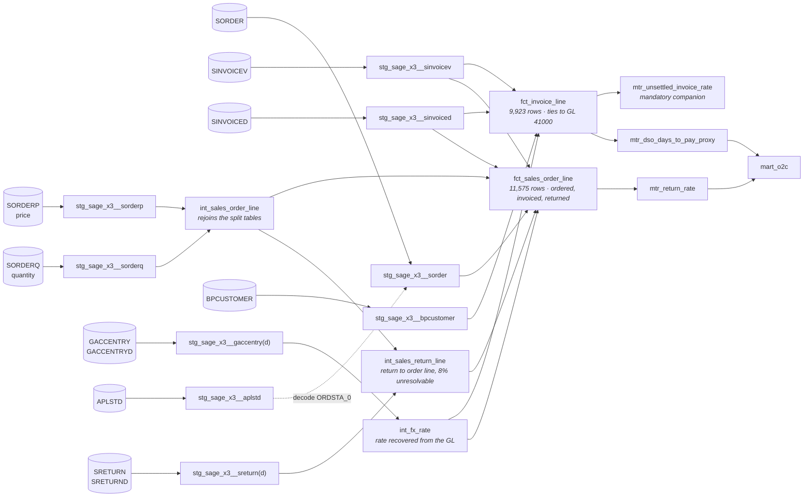

`int_fx_rate` feeding both money facts is what stops USD and CAD amounts being
added together by accident — every monetary column exists as `_doc` and `_usd`.

### 4.4 Purchasing and inventory path — Match Rate, Inventory Accuracy

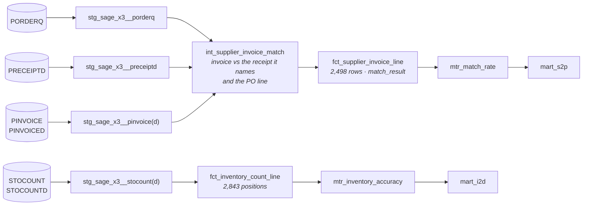

Comparing each invoice line to the receipt *it names*, rather than to the
cumulative received quantity on the PO line, is the decision that matters
here: 514 lines are multi-delivery, and the cumulative comparison would report
a variance on both halves of a perfectly good transaction — 59.2% matched
instead of 70.7%.

### 4.5 Entity resolution path

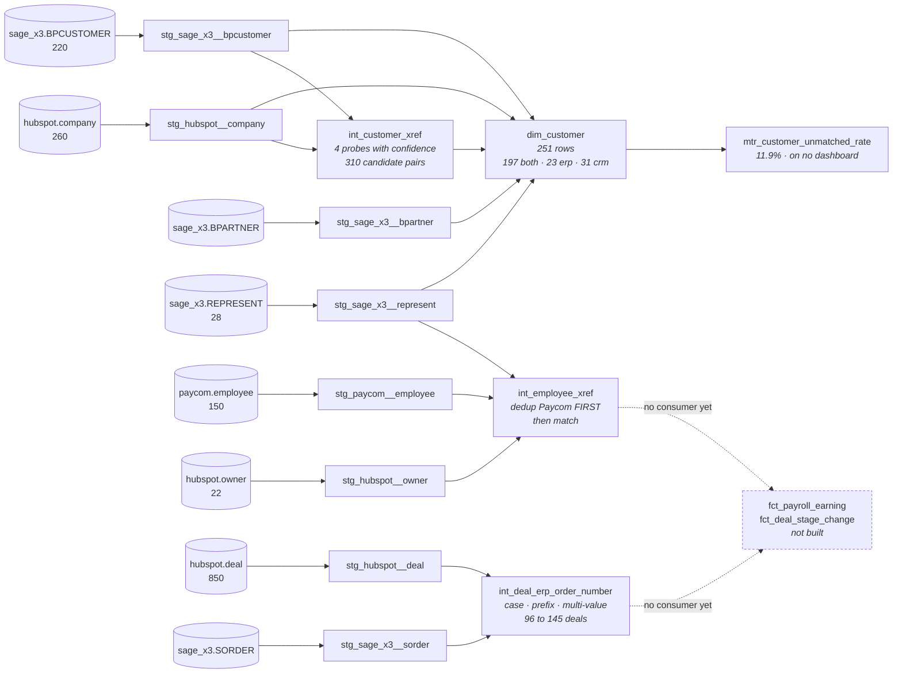

**Two intermediate models have no downstream consumer.** `int_employee_xref`
and `int_deal_erp_order_number` are built, tested and documented but nothing in
`marts/core/` reads them, because no active metric needs an employee or a CRM
deal. They exist because the plan requires entity resolution to be first-class
and inspectable, and because their findings — 138 people behind 150 rows, 96 to
145 recoverable deals — are governance results the client needs whether or not
a dashboard consumes them. When `fct_payroll_earning` or
`fct_deal_stage_change` gets built, the resolution is already done and tested.

That is a deliberate choice, not an oversight, and it is the kind of thing a
DAG makes visible.

### 4.6 Metric and process generation

The part with no dbt lineage, because the edges are scripts rather than `ref()`.

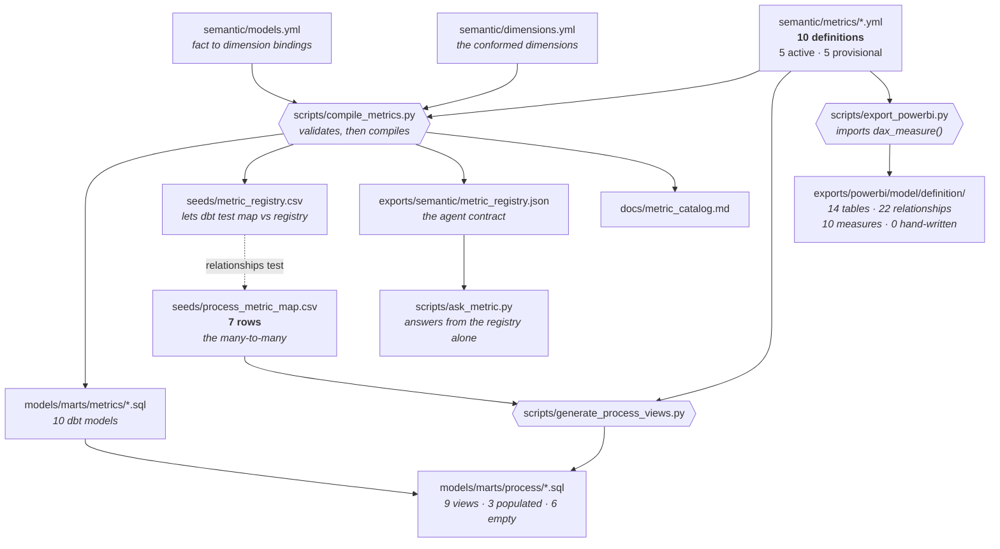

One edge is worth tracing: **`metric_registry.csv` back to
`process_metric_map.csv`.** The registry is compiled into a seed so dbt can
enforce referential integrity between the map and the definitions with an
ordinary `relationships` test. A typo in the map fails the build instead of
producing an empty dashboard tile.

The six empty process views have no incoming edge at all: with no metric
mapped, each emits typed, empty output and references no model. The DAG
showing nothing upstream of them is correct and is what the empty case should
look like.

### 4.7 What the DAGs do not show

- **Tests.** They attach to models rather than sitting between them. Four warn
  with documented thresholds; none error.
- **Materialisation.** Staging, intermediate ratios and process views are
  views; `marts/core` and the heavier intermediate models are tables.
  Everything is a full refresh — correct at this volume.
- **The ingestion asymmetry that will drive the real design.** X3 carries
  `UPDTICK_0` and HubSpot carries `hs_lastmodifieddate`, so both support
  incremental extraction. Paycom carries neither and is full-refresh-only. That
  belongs in the ingestion architecture, not in this pipeline.

---

## Regenerating these diagrams

The measured figures come from:

```bash
python scripts/profile_sources.py     # every source-side number
dbt docs generate                     # interactive DAG, full lineage
dbt docs serve
```

The lineage in section 4 was extracted from `target/manifest.json` after a full
`dbt build`. If you add a model, regenerate the manifest and check this page
still matches — a stale architecture diagram is worse than none, because people
trust it.
