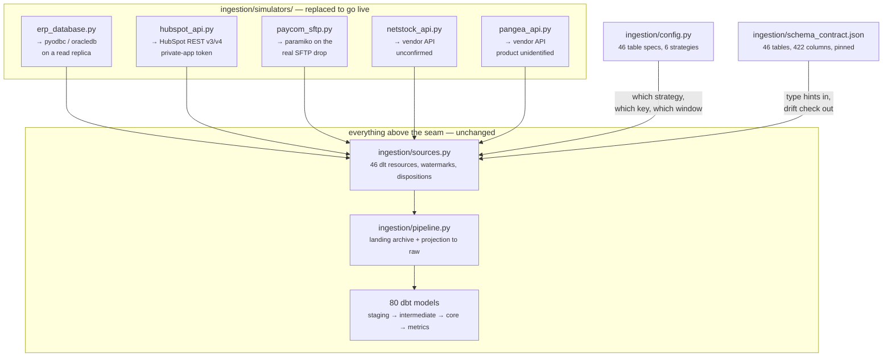
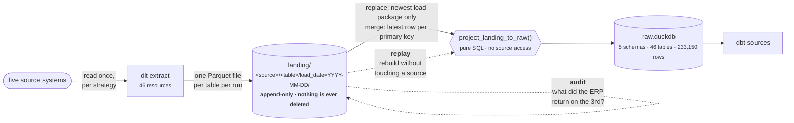
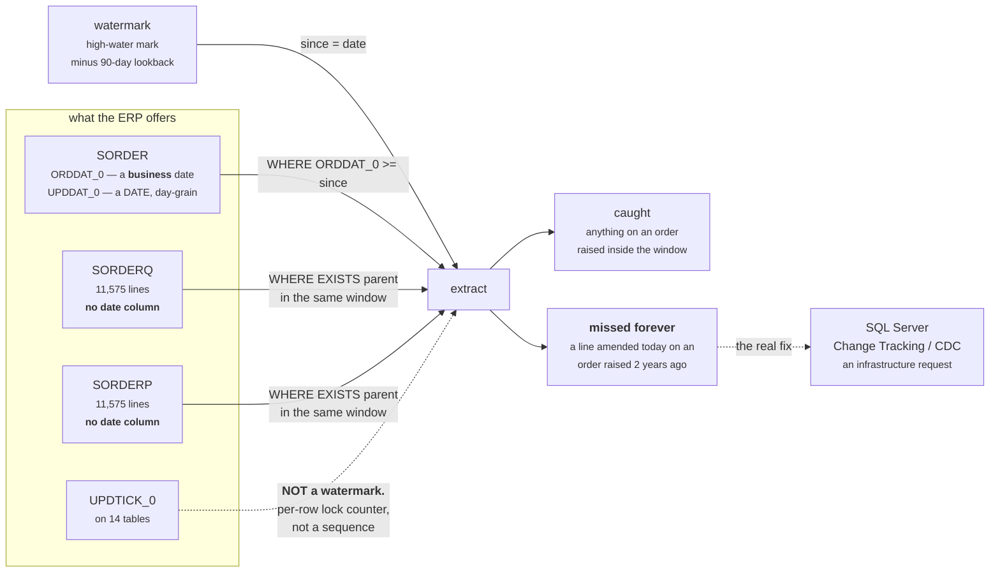
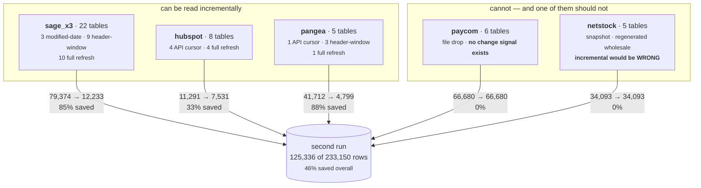
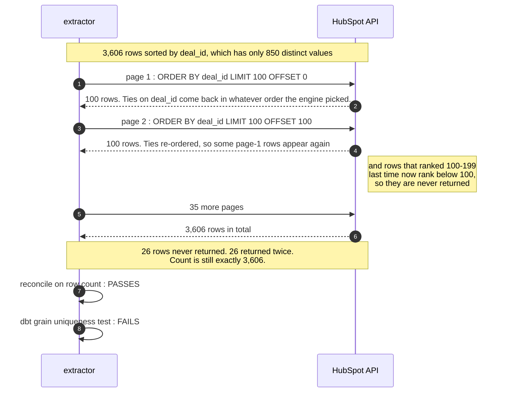

# Ingestion: source systems to usable metrics

The scope document for the half of the work the original POC stubbed out.

Everything before this was a transformation project handed a DuckDB file.
There is now a working extraction layer in front of it, built to the shape of
the real access patterns rather than the convenience of a local database, and
proven to change no number:

```
source systems  →  dlt extract  →  landing/  →  raw.duckdb  →  dbt  →  metrics
   5 systems       46 resources    Parquet      5 schemas      80        7
                                   append-only  233,150 rows   models    live
```

```bash
python run_ingestion.py --explain   # the extraction spec, per table
python run_ingestion.py             # source systems -> raw
dbt build                           # raw -> metrics
python scripts/verify_ingestion.py  # prove it changed nothing
```

---

## 1. What is real and what is simulated

This distinction matters more than anything else in the document, so it is
first.

| Layer | Status | File |
|---|---|---|
| Extraction **spec** — strategy, keys, watermarks, notes per table | **Real** | `ingestion/config.py` |
| dlt resources, watermark handling, dispositions | **Real** | `ingestion/sources.py` |
| Landing archive, projection to raw, drift detection | **Real** | `ingestion/pipeline.py` |
| Schema contract and drift checking | **Real** | `ingestion/contract.py`, `schema_contract.json` |
| The five **clients** that talk to the source systems | **Simulated** | `ingestion/simulators/` |

`ingestion/simulators/` is the seam. Each module reads `mock_sources.duckdb`
but exposes the *access pattern* of the real system: the ERP answers a SQL
predicate, HubSpot hands back a page and a cursor, Paycom hands back a file
that appeared on an SFTP drop. Every module's docstring names exactly what
changes in production. Nothing above that package knows the difference.

**Going live means replacing five files.** The spec, the dispositions, the
watermark logic, the landing layout, the contract and the dbt sources do not
move.



Read it as a load-bearing wall. The five boxes at the top are the only ones
that know a source system exists; everything below them is written against
rows, and a row from a real ERP looks exactly like a row from this one.

---

## 2. Architecture, and why it is two stages



Loading straight into the warehouse would have been half the code. Three
reasons not to:

**Replayable.** The raw schema is a pure projection of the archive, so the
warehouse can be rebuilt without touching a source system. That matters most
for the sources you *cannot* re-read — a Paycom export is gone once the next
one overwrites it, and there is no "give me last Tuesday" endpoint.

**Auditable.** Every extract is preserved with its load id. "What did the ERP
actually return on the 3rd" is answerable, which is the difference between
debugging a discrepancy in an hour and arguing about it for a week.

**Decoupled.** A failed or partial extract cannot corrupt the raw schema.

The projection is where write disposition is honoured. Replace-style tables
take the newest load package only; merge-style tables union every package and
keep the most recent row per primary key:

```sql
select * exclude (_dlt_load_id, _dlt_id, load_date)
from read_parquet('landing/sage_x3/SORDERQ/**/*.parquet', hive_partitioning => true)
qualify row_number() over (
    partition by "SOHNUM_0", "SOPLIN_0" order by _dlt_load_id desc
) = 1
```

---

## 3. Per system: difficulty, and where it actually is

| System | Technical difficulty | Real constraint | Build |
|---|---|---|---|
| **HubSpot** | Low | Nothing. Good API, real cursor, wide connector support | 2–4 days |
| **Sage X3** | Moderate | Weak change tracking (§4). Access and a read replica | 1–3 weeks |
| **Paycom** | Low | **Coordination.** 2–6 weeks of lead time you do not control | 3–5 days |
| **Netstock** | Unknown | Schedule risk. API is built to sync with an ERP, not feed a warehouse | 3 days–2 weeks |
| **Pangea** | Unknown | Schedule risk. Product still unidentified | unscoped |
| Cross-cutting | — | Orchestration, secrets, monitoring, backfill | 1–2 weeks |

Roughly **5–9 engineer-weeks of build**, and that is not what sets the date.

### What sets the date

1. **Access.** Credentials, a read replica so reporting cannot contend with
   transaction posting, VPN or private endpoint, firewall rules. Days in an SMB
   where one person owns IT; 4–8 weeks where there is an MSP or a change board.
   **Start this before anything else.**
2. **Paycom's lead time.** A Paycom admin has to configure scheduled reports
   and often Paycom support has to enable SFTP delivery. That clock runs
   independently of your work. Start it in week one.
3. **A security review you did not plan for.** Payroll is PII — this extract
   carries salaries and SSN fragments. Expect a conversation about who can read
   the `paycom` schema, and expect it to cost calendar time.
4. **The two unknowns.** Netstock and Pangea are the genuine schedule risk
   because you cannot estimate what you have not seen. Get a sample extract
   during discovery, not during build.

---

## 4. The finding that shapes the ERP extract

**19 of 22 Sage X3 tables carry no modification date**, and the three that do
carry a `DATE` rather than a timestamp — so even the good case is day-grain.

`UPDTICK_0` is present on 14 tables and **is not a watermark.** It is a
per-row optimistic-lock counter, not a table-wide monotonic sequence, so
`WHERE UPDTICK_0 > :last` is meaningless. Use it to detect whether a specific
row changed during reconciliation; never to drive an extract.

So the line tables are windowed through their parent's *business* date:

| Table | Strategy | Window | Rows |
|---|---|---|---|
| `SORDERQ` / `SORDERP` | header window | `SORDER.ORDDAT_0` | 11,575 ea. |
| `SINVOICED` | header window | `SINVOICEV.INVDAT_0` | 9,767 |
| `GACCENTRYD` | header window | `GACCENTRY.ACCDAT_0` | 10,692 |
| `PORDERQ` | header window | `PORDER.ORDDAT_0` | 2,959 |
| `STOJOU` | header window | own `IPTDAT_0` | 16,421 |
| `SORDER`, `ITMMASTER`, `BPCUSTOMER` | modified date | `UPDDAT_0` | — |
| 10 reference tables | full refresh | — | small |



**The trap.** A business date is not a modification date. An order line amended
today on an order raised last year has an `ORDDAT_0` of last year, so it falls
outside any window keyed on the order date and is **missed forever**. The 90-day
lookback (`config.DEFAULT_LOOKBACK_DAYS`) buys margin, not correctness.

`PORDERQ` is the sharpest case: `RCPQTY_0` and `RCPDAT_0` are updated in place
when goods arrive, so a PO ordered outside the window and received inside it is
silently lost. That is called out in the spec, and it is the strongest argument
for the real fix.

**The real fix is SQL Server Change Tracking or CDC.** It is an infrastructure
request rather than a data-engineering one, so raise it early. Failing that,
full refresh the affected tables — at this data volume that is genuinely the
right answer, and it is the one nobody wants to say out loud.

Measured effect of the incremental design on a second run:

| Source | Run 1 | Run 2 | Saved | Why |
|---|---|---|---|---|
| `sage_x3` | 79,374 | 12,233 | 85% | windowed on business/modification dates |
| `pangea` | 41,712 | 4,799 | 88% | `created_at` cursor with lookback |
| `hubspot` | 11,291 | 7,531 | 33% | `hs_lastmodifieddate` cursor |
| `paycom` | 66,680 | 66,680 | **0%** | no change signal, ever |
| `netstock` | 34,093 | 34,093 | **0%** | snapshot source — full replace is correct |
| **total** | **233,150** | **125,336** | **46%** | |



Two of the five sources cannot be read incrementally at all, and for Netstock
that is not a limitation — an incremental read would be *wrong*, because a row
that drops out of the recomputed set would persist in the warehouse forever.

---

## 5. Pitfalls, in the order they will bite

These are not hypothetical. Three of the six below actually happened during
this build.

### 5.1 Offset pagination over a non-unique key — **silent, and it happened**

The first version of the HubSpot client paged `deal_stage_history` ordered by
`deal_id`: 850 distinct values across 3,606 rows. Offset pagination over a
non-unique sort key lets the database return ties in a different order on each
page request, so rows are both skipped and repeated.



**It lost 26 rows and duplicated 26 others — and the row count was still
exactly 3,606.** A count-based reconciliation passed. The only thing that
caught it was the grain uniqueness test in dbt.

> Paginate on a unique key, or use keyset/cursor pagination — which is what
> HubSpot's `after` token actually is. And keep grain tests on staging, because
> they are the last line of defence against an extractor that lies politely.

### 5.2 An all-null column disappears — **also happened**

On the first run, `paycom.employee.rehire_date` and `manager_ee_id` were null
on all 150 rows. dlt could not infer a type and dropped both columns. Staging
references them. The pipeline reported success and the warehouse was wrong.

This is not a dlt defect — Fivetran, Airbyte and every hand-rolled extractor
share it, because a column that is null everywhere is indistinguishable from a
column that is not there.

> Pin the schema. `ingestion/schema_contract.json` declares all 46 tables and
> 422 columns; every resource is given those types as hints, and every run
> compares what arrived against them. A lost column is reported as an
> **INCIDENT** and the run exits non-zero.
>
> Regenerating the contract to make a failing run pass is the one thing you
> must never do.

### 5.3 Archived records are not returned unless you ask

HubSpot does not return archived objects by default. Omitting the second pass
silently loses 12 companies, 23 contacts and 11 deals here. They are *not*
deletions — they arrive as `archived = true`, and the mart decides what to do
with them, never the extractor.

### 5.4 N+1 child fetches die on the backfill

Charges and tracking events hang off the shipment. Fetching them per shipment
is **10,535 API calls**; batching parent ids is **24**. Invisible at POC scale,
fatal on a historical backfill.

If the real API has no bulk or date-ranged child endpoint, that has to be found
during discovery — it changes the backfill plan, not just the code.

### 5.5 A late-posting child breaks a strict high-water mark

Pangea charges post after the shipment is created and delivery events arrive
days later. A cursor that only ever collects *new* shipments will permanently
under-report cost and never see a delivery. Shipments are therefore re-read
over a lookback rather than collected once.

The metric this protects is Cost Per Shipment, where the header already
disagrees with the charge lines by 9.9%.

### 5.6 A missing file looks exactly like an unchanged one

A Paycom report that silently stops arriving is indistinguishable from a report
with no changes. `paycom_sftp.read_latest()` therefore raises if the newest
file is older than the expected cadence, rather than loading it.

Related, and cheap to get wrong: read by **header name, never by position**.
Anyone with report-builder access can reorder or add a column and nobody will
be told.

---

## 6. Rules the extractors follow

Each of these is a decision, and each has a cost if reversed.

**Enumerate columns, never `SELECT *`.** A `SELECT *` against X3 pulls hundreds
of columns you do not need and breaks silently when Sage adds one in an
upgrade. The column list also documents what the warehouse depends on, which is
what makes an upgrade impact assessment possible at all.

**Push predicates to the source.** The window is computed in the extractor and
sent as SQL. Pulling everything and filtering in Python is how a nightly job
becomes a four-hour job.

**Cast nothing.** Landing records what actually arrived — Paycom dates stay
`MM/DD/YYYY` strings, amounts stay strings, X3 keys stay CHAR-padded. Casting in
the extractor destroys the evidence when a value later fails to parse. Staging
casts; that is its entire job.

**Filter nothing.** The 35 orphaned Netstock item-locations, the archived
HubSpot records and the out-of-sequence tracking events all land. Filtering is
a business rule and belongs above staging.

**Landing is append-only.** Nothing is ever deleted from the archive. Current
state is a projection, which is what makes replay possible.

---

## 7. Production changes

What actually differs from what is committed here.

| Concern | Now | Production |
|---|---|---|
| Source clients | `ingestion/simulators/` | pyodbc/oracledb, HubSpot REST, paramiko SFTP, vendor APIs |
| Secrets | none | a secret manager; dlt reads `secrets.toml` or env |
| Landing | local `landing/` | S3/ADLS/GCS. dlt's filesystem destination takes a bucket URL — one config line |
| Raw store | `raw.duckdb` | MotherDuck, Snowflake, BigQuery, Fabric. dbt sources change database name only |
| Orchestration | run by hand | GitHub Actions cron is enough for daily batch at this volume; Dagster/Prefect when it grows |
| Monitoring | exit code | alert on: non-zero exit, drift INCIDENT, stale Paycom file, extracted-row anomalies |
| Backfill | one run | chunk the first X3 load by year; pace HubSpot against the rate limit |
| Retention | unbounded | archive lifecycle policy — landing grows forever by design |

**What does not change:** `config.py`, `sources.py`, `pipeline.py`,
`contract.py`, the schema contract, the landing layout, the projection SQL, and
every one of the 80 dbt models.

### Connector naming conventions

dlt is configured with the `direct` naming convention so `ITMREF_0` stays
`ITMREF_0`. **Fivetran and Airbyte lowercase by default**, which would turn
every X3 column name into `itmref_0` and break all 46 staging models.

Because staging is *generated* from a column spec rather than hand-written,
adapting is one flag in `scripts/generate_staging.py` rather than 46 file
edits. That is the clearest payoff yet from generating the staging layer, and
it was not the reason for doing it.

---

## 8. What is still not covered

Named so the scope is honest.

- **Deletes.** No source here exposes a deletion feed. A row hard-deleted in X3
  persists in the warehouse forever under merge disposition. Detecting that
  needs full refresh, a periodic key reconciliation, or database CDC — a real
  gap, not a POC shortcut.

  The *decision* is no longer only prose: `TableSpec.reconcile_keys` declares
  it per table (`weekly` on all 20 merge-disposition tables, `never` on the 26
  that are replaced wholesale), and `run_ingestion.py --explain` prints it in a
  `deletes` column beside the strategy. The reconciliation itself is not built.
  Declaring the intent next to the strategy and the lookback is what stops it
  being re-derived by whoever eventually builds it.
- **Schema evolution beyond detection.** Drift is reported; nothing adapts
  automatically, which is deliberate. A new column should be a decision.
- **Backfill chunking.** The first load reads everything in one pass. Fine at
  233,150 rows, wrong at 50 million.
- **Archive rescan cost.** `project_landing_to_raw()` rescans the *entire*
  landing archive on every run for every merge-disposition table, keeping the
  latest row per key. Elegant and correct, and *O*(all history) forever — so it
  degrades with **archive age**, not with source volume. That is the less
  obvious of the two and the one that surprises people: a pipeline that has run
  nightly for a year is reading a year of Parquet to rebuild a table that did
  not change. The fix when it bites is a compacted "current" partition plus
  incremental projection over newer load packages only, which is a rewrite of
  one function.
- **Retry and backoff.** The rate limiter raises rather than backing off. In
  production a 429 is a `Retry-After` header, not a failure.
- **Two source systems remain unidentified.** Netstock's API is unconfirmed and
  Pangea's product is a guess. Those are discovery items with real schedule
  risk attached, and no amount of framework removes them.
